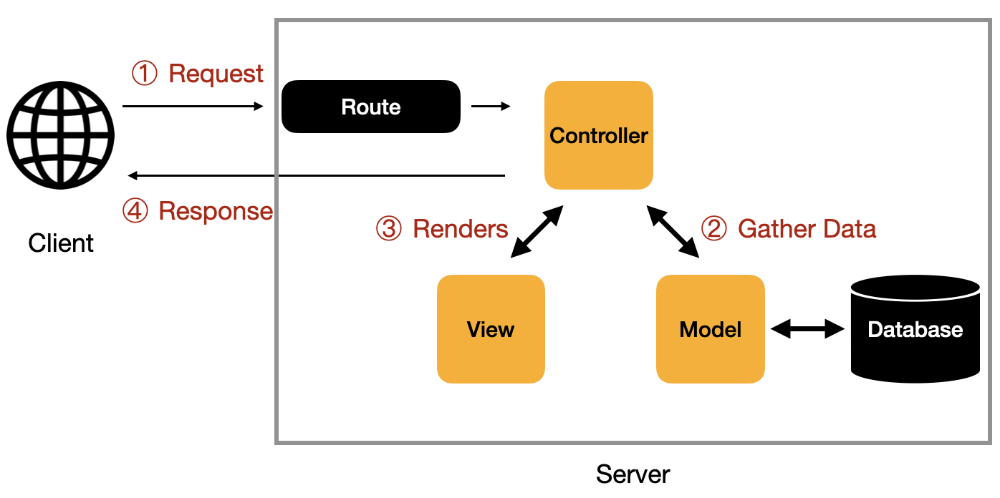

# Introducción a Flask

Este repositorio contiene los ejemplos utilizados en el seminario de [Flask][1] de la
asignatura de [Negocio Electrónico][2].

En este seminario vamos ver cómo crear una aplicación web **muy básica** con
[Flask][1] y cómo integrar el modelo [LSTM][3] (_Long Short-Term Memory_) que
desarrollamos en el seminario anterior con [TensorFlow/Keras][4].

El modelo era capaz de analizar una frase de un cliente y clasificarla en una
de las siguientes categorías: `AYUDA`, `OK` y `SERVICIO_TECNICO`.

## 1. Introducción

### 1.1 Sesiones previas

- Primera sesión: [Introducción a Python][6].
- Segunda sesión: [Creacion de un modelo LSTM con TensorFlow][7].

### 1.2 Requisitos previos

- Necesitará un versión de Python que esté entre la 3.8 y [3.11][4].
- Se recomienda el uso [entornos virtuales con virtualenv][5].
- Se recomienda el uso de [Visual Studio Code][8].

### 1.3 Creación y activación del entorno virtual

**Linux y macOS**

```bash
# Creamos el entorno virtual
python3.11 -m venv .venv

# Activamos el entorno virtual
source .venv/bin/activate
```

**Windows**

```bash
# Creamos el entorno virtual
py -3.11 -m venv .venv

# Activamos el entorno virtual en PowerShell
.venv\Scripts\Activate.ps1
```

### 1.4 Instalación de las dependencias de forma manual

Para poder realizar los ejemplos de este seminario vamos a necesitar instalar
`flask` y `tensorflow`.

```bash
# Instalamos Flask
pip install flask

# Instalamos Tensorflow
pip install tensorflow
```

### 1.5 Creación del archivo `requeriments.txt`

```bash
pip freeze > requirements.txt
```

Una vez que hemos creado el archivo `requirements.txt`, cuando queramos instalar
las dependencias en otro entorno, sólo tendremos que ejecutar el siguiente
comando:

```bash
pip install -r requirements.txt
```

## 2. Conceptos básicos

### 2.1 ¿Qué es Flask?

Flask es un **micro-framework** escrito en Python que permite crear aplicaciones
web rápidamente de forma sencilla. Es ideal para proyectos pequeños o
prototipos.

### 2.2 Instalación de Flask

- https://flask-es.readthedocs.io/installation/

### 2.3 ¿Qué es el patrón MVC en aplicaciones web?

**MVC** (_Model-View-Controller_) es un patrón de diseño que separa una
aplicación en tres componentes:

- **Modelo**: Gestiona los datos y la lógica de negocio (base de datos, reglas de validación).
- **Vista**: Maneja la presentación de datos (plantillas HTML).
- **Controlador**: Recibe las peticiones del usuario, interactúa con el Modelo y renderiza la Vista.


Imagen: Descripción del patrón MVC. Imagen obtenida de la página [ExplainThis](https://www.explainthis.io/en/swe/mvc).


### 2.3 Creación de una aplicación Flask

Vamos a crear un archivo que se llama `app.py` con el siguiente contenido:

```python
from flask import Flask

# Creamos una instancia de Flask
app = Flask(__name__)

# Definimos los endpoints de la aplicación
@app.route('/')
def index():
    return 'Hola, mundo!'

# Programa principal
if __name__ == '__main__':
    app.run(debug=True)
```

> [!NOTE]
> [Ejemplo 01](ejemplo_01)

### 2.4 Ejecución de la aplicación

**Linux y macOS**

```bash
python app.py
```

**Windows**

```bash
py app.py
```

## 3. Ejemplos

### 3.1 Ejemplo 01

> [!NOTE]
> [Ejemplo 01](ejemplo_01/app.py)

### 3.2 Ejemplo 02

> [!NOTE]
> [Ejemplo 02](ejemplo_02/app.py)

### 3.3 Ejemplo 03

> [!NOTE]
> [Ejemplo 03](ejemplo_03/app.py)

### 3.4 Ejemplo 04

> [!NOTE]
> [Ejemplo 04](ejemplo_04/app.py)

### 3.5 Ejemplo 05

> [!NOTE]
> [Ejemplo 05](ejemplo_05/app.py)

### 3.6 Ejemplo 06

> [!NOTE]
> [Ejemplo 06](ejemplo_06/app.py)

### 3.7 Ejemplo 07

> [!NOTE]
> [Ejemplo 07](ejemplo_07/app.py)

### 3.8 Ejemplo 08

> [!NOTE]
> [Ejemplo 08](ejemplo_08/app.py)

### 3.9 Ejemplo 09

> [!NOTE]
> [Ejemplo 09](ejemplo_09/app.py)

### 3.10 Ejemplo 10

> [!NOTE]
> [Ejemplo 10](ejemplo_10/app.py)

### 3.11 Ejemplo 11

> [!NOTE]
> [Ejemplo 11](ejemplo_11/app.py)

### 3.12 Ejemplo 12

> [!NOTE]
> [Ejemplo 12](ejemplo_12/app.py)

## Créditos

La imagen del patrón MVC ha sido obtenida de la página [ExplainThis](https://www.explainthis.io/en/swe/mvc).

## Referencias

- https://flask-es.readthedocs.io/quickstart/
- https://flask-es.readthedocs.io/tutorial/

[1]: https://flask.palletsprojects.com/es/stable/
[2]: https://www.ual.es/estudios/grados/presentacion/plandeestudios/asignatura/4015/40153316
[3]: https://github.com/josejuansanchez/modelo-lstm-tensorflow/
[4]: https://www.python.org/downloads/release/python-3119/
[5]: https://josejuansanchez.org/python-for-java-developers/#_entornos_virtuales_
[6]: https://josejuansanchez.org/python-for-java-developers/
[7]: https://github.com/josejuansanchez/modelo-lstm-tensorflow
[8]: https://code.visualstudio.com