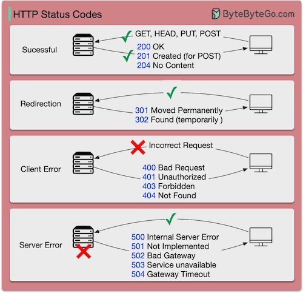

# Introducción a Flask

Este repositorio contiene los ejemplos utilizados en el seminario de [Flask][1] de la
asignatura de [Negocio Electrónico][2].

En este seminario vamos ver cómo crear una aplicación web **muy básica** con
[Flask][1] y cómo integrar el modelo [LSTM][3] (_Long Short-Term Memory_) que
desarrollamos en el seminario anterior con [TensorFlow/Keras][4].

## Índice de contenidos

- [1. Introducción](#1-introducción)
  - [1.1 Sesiones previas](#11-sesiones-previas)
  - [1.2 Requisitos previos](#12-requisitos-previos)
  - [1.3 Creación y activación del entorno virtual](#13-creación-y-activación-del-entorno-virtual)
  - [1.4 Desactivación del entorno virtual](#14-desactivación-del-entorno-virtual)
  - [1.5 Instalación de las dependencias de forma manual](#15-instalación-de-las-dependencias-de-forma-manual)
  - [1.6 Creación del archivo `requeriments.txt`](#16-creación-del-archivo-requerimentstxt)
- [2. Conceptos básicos](#2-conceptos-básicos)
  - [2.1 ¿Qué es Flask?](#21-qué-es-flask)
  - [2.2 ¿Qué es el patrón MVC en aplicaciones web?](#22-qué-es-el-patrón-mvc-en-aplicaciones-web)
  - [2.3 Creación de una aplicación web en Flask](#23-creación-de-una-aplicación-web-en-flask)
  - [2.4 Ejecución de la aplicación en un entorno de desarrollo](#24-ejecución-de-la-aplicación-en-un-entorno-de-desarrollo)
  - [2.5 Cómo desplegar una aplicación Flask en un entorno de producción](#25-cómo-desplegar-una-aplicación-flask-en-un-entorno-de-producción)
- [3. Ejemplos](#3-ejemplos)
  - [3.1 Ejemplo 01. `Hola, mundo!`](#31-ejemplo-01-hola-mundo)
  - [3.2 Ejemplo 02. Enrutamiento con `@app.route`](#32-ejemplo-02-enrutamiento-con-approute)
  - [3.3 Ejemplo 03. Rutas con barras al final](#33-ejemplo-03-rutas-con-barras-al-final)
  - [3.4 Ejemplo 04. Secciones variables en las rutas](#34-ejemplo-04-secciones-variables-en-las-rutas)
  - [3.5 Ejemplo 05. Gestión de errores y redirecciones](#35-ejemplo-05-gestión-de-errores-y-redirecciones)
  - [3.6 Ejemplo 06. Métodos HTTP (`GET` y `POST`)](#36-ejemplo-06-métodos-http-get-y-post)
  - [3.7 Ejemplo 07. Métodos HTTP (`GET` y `POST`)](#37-ejemplo-07-métodos-http-get-y-post)
  - [3.8 Ejemplo 08. Plantillas Jinja2](#38-ejemplo-08-plantillas-jinja2)
  - [3.9 Ejemplo 09. Plantillas Jinja2 con hojas de estilo CSS](#39-ejemplo-09-plantillas-jinja2-con-hojas-de-estilo-css)
  - [3.10 Ejemplo 10. Formularios](#310-ejemplo-10-formularios)
  - [3.11 Ejemplo 11. Formularios](#311-ejemplo-11-formularios)
  - [3.12 Ejemplo 12. Cómo integrar nuestro modelo LSTM en la aplicación web](#312-ejemplo-12-cómo-integrar-nuestro-modelo-lstm-en-la-aplicación-web)
    

## 1. Introducción

### 1.1 Sesiones previas

- Primera sesión: [Introducción a Python][6].
- Segunda sesión: [Creacion de un modelo LSTM con TensorFlow][7].

### 1.2 Requisitos previos

- Necesitará un versión de Python que esté entre la 3.8 y [3.11][4].
- Se recomienda el uso [entornos virtuales con virtualenv][5].
- Se recomienda el uso de [Visual Studio Code][8].

### 1.3 Creación y activación del entorno virtual

**Linux y macOS**

```bash
# Creamos el entorno virtual
python3.11 -m venv .venv

# Activamos el entorno virtual
source .venv/bin/activate
```

**Windows**

```bash
# Creamos el entorno virtual
py -3.11 -m venv .venv

# Activamos el entorno virtual en PowerShell
.venv\Scripts\Activate.ps1
```

### 1.4 Desactivación del entorno virtual

Cuando haya terminado de trabajar con el entorno virtual, puede desactivarlo
ejecutando el siguiente comando:

```bash
deactivate
```

### 1.5 Instalación de las dependencias de forma manual

Para poder realizar los ejemplos de este seminario vamos a necesitar instalar
`flask` y `tensorflow`.

```bash
# Instalamos Flask
pip install flask

# Instalamos Tensorflow
pip install tensorflow
```

### 1.6 Creación del archivo `requeriments.txt`

```bash
pip freeze > requirements.txt
```

Una vez que hemos creado el archivo `requirements.txt`, cuando queramos instalar
las dependencias en otro entorno, sólo tendremos que ejecutar el siguiente
comando:

```bash
pip install -r requirements.txt
```

## 2. Conceptos básicos

### 2.1 ¿Qué es Flask?

[Flask][1] es un **microframework** escrito en Python que permite crear
aplicaciones web rápidamente de forma sencilla. Es ideal para proyectos
pequeños, prototipos o APIs.

[Flask][1] depende de dos librerías:

- [Werkzeug][9] para implementar el estándar [WSGI][11] (*Web Server Gateway
  Interface*) que permite que un servidor web pueda comunicarse con una
  aplicación Python.
- [Jinja2][10] para manejar las plantillas (HTML). 

### 2.2 ¿Qué es el patrón MVC en aplicaciones web?

**MVC** (_Model-View-Controller_) es un patrón de diseño que separa una
aplicación en tres componentes:

- **Modelo**: Gestiona los datos y la lógica de negocio (base de datos, reglas de validación).
- **Vista**: Maneja la presentación de datos (plantillas HTML).
- **Controlador**: Recibe las peticiones del usuario, interactúa con el Modelo y renderiza la Vista.


Imagen 1: Descripción del patrón MVC. Imagen obtenida de la página [ExplainThis](https://www.explainthis.io/en/swe/mvc).

### 2.3 Creación de una aplicación web en Flask

Vamos a crear un archivo que se llama `app.py` con el siguiente contenido:

```python
# Importamos la clase Flask del paquete flask
from flask import Flask

# Creamos una instancia de Flask
app = Flask(__name__)

# Definimos los endpoints de la aplicación
@app.route('/')
def index():
    return '<h1>Hola, mundo!</h1>'

# Programa principal
if __name__ == '__main__':
    app.run(debug=True)
```

### 2.4 Ejecución de la aplicación en un entorno de desarrollo

En nuestro entorno de desarrollo, utlizaremos el servidor web que viene
integrado en Flask. 

**Linux y macOS**

```bash
python app.py
```

**Windows**

```bash
py app.py
```

### 2.5 Cómo desplegar una aplicación Flask en un entorno de producción

Para ejecutar una aplicación Flask en un entorno de producción, se recomienda
utilizar un servidor WSGI como [Gunicorn](https://gunicorn.org/).


## 3. Ejemplos

### 3.1 Ejemplo 01. `Hola, mundo!`

```python
from flask import Flask

# Creamos una instancia de Flask
app = Flask(__name__)

# Definimos los endpoints de la aplicación
@app.route('/')
def index():
    return '<h1>Hola, mundo!</h1>'

# Programa principal
if __name__ == '__main__':
    app.run(debug=True)
```

> [!NOTE]
> [Ejemplo 01](ejemplo_01/app.py)

**Ejercicio**

1. Despliegue la aplicación web en su entorno de desarrollo.
2. Abra un navegador y acceda a la URL `http://localhost:5000`.

### 3.2 Ejemplo 02. Enrutamiento con `@app.route`

```python
from flask import Flask

# Creamos una instancia de Flask
app = Flask(__name__)

# Definimos los endpoints de la aplicación
@app.route('/')
def index():
    return 'Página principal'

@app.route('/contacto')
def contacto():
    return 'Contacto'

@app.route('/formulario')
def formulario():
    return 'Formulario'

# Programa principal
if __name__ == '__main__':
    app.run(debug=True)
```

> [!NOTE]
> [Ejemplo 02](ejemplo_02/app.py)

**Ejercicio**

1. ¿Qué ocurre si accedemos a la URL `http://127.0.0.1:5000/contacto`?
2. ¿Y si accedemos a la URL `http://127.0.0.1:5000/contacto/`?
3. ¿Qué está ocurriendo?

### 3.3 Ejemplo 03. Rutas con barras al final

```python
from flask import Flask

# Creamos una instancia de Flask
app = Flask(__name__)

# Definimos los endpoints de la aplicación
@app.route('/')
def index():
    return 'Página principal'

@app.route('/contacto/')
def contacto():
    return 'Contacto'

@app.route('/formulario/')
def formulario():
    return 'Formulario'

# Programa principal
if __name__ == '__main__':
    app.run(debug=True)
```

> [!NOTE]
> [Ejemplo 03](ejemplo_03/app.py)

Si definimos la ruta con una barra al final:

```python
@app.route('/contacto/')
```

Flask gestionará la URL como si fuese un directorio. Por lo tanto, si accedemos
a `/contacto` (sin barra), Flask automáticamente hará una redirección HTTP `301` a
`/contacto/`.

Sin embargo, si definimos la ruta sin barra al final:

```python
@app.route('/contacto')
```

Flask gestionará la URL como un archivo individual, y al acceder a `/contacto/`
(con barra al final), Flask devolverá un error HTTP `404`, de recurso no
encontrado.

### 3.4 Ejemplo 04. Secciones variables en las rutas

```python
from flask import Flask

# Creamos una instancia de Flask
app = Flask(__name__)

# Definimos los endpoints de la aplicación
@app.route('/<string:name>')
def index(name):
    return f"Hola {name}!"

@app.route('/producto/<int:id>')
def producto(id):
    return f"Producto: {id}"

@app.route('/producto/<float:price>')
def precio(price):
    return f"Precio: {price}"

@app.route('/path/<path:subpath>')
def path(subpath):
    return f"Subpath: {subpath}"

# Programa principal
if __name__ == '__main__':
    app.run(debug=True)
```

> [!NOTE]
> [Ejemplo 04](ejemplo_04/app.py)

Los diferentes tipos de convertidores que podemos utilizar en las rutas son:

- `string`: Acepta cualquier texto sin barras. Es la opción por defecto.
- `int`: Acepta números enteros.
- `float`: Acepta números en coma flotante.
- `path`: Acepta cualquier texto, incluyendo barras.
- `uuid`: Acepta UUIDs.

**Ejercicios**

1. Añada las ruta `@app.route('/')` y `@app.route('/<string:name>')` a la
   función `index` de forma que muestre un mensaje genérico cuando se acceda a la ruta `/` y un mensaje personalizado cuando se acceda a la ruta `/<string:name>`.
2. Crea una ruta `/cuadrado/<int:numero>` que devuelva el cuadrado del número recibido.
3. Crea una ruta `/suma/<int:num1>/<int:num2>` que devuelva la suma de los dos números recibidos.

### 3.5 Ejemplo 05. Gestión de errores y redirecciones

```python
from flask import Flask
from flask import redirect

# Creamos una instancia de Flask
app = Flask(__name__)

# Definimos los endpoints de la aplicación
@app.route('/')
def index():
    return f"Página principal"

@app.errorhandler(404)
def page_not_found(error):
    return f"La página no existe. Error: {error}", 404

@app.route('/redireccion')
def redireccion():
    return redirect('/')
    #return redirect('/', code=301)    

# Programa principal
if __name__ == '__main__':
    app.run(debug=True)
```

> [!NOTE]
> [Ejemplo 05](ejemplo_05/app.py)

**Gestión de errores**

El decorador `@app.errorhandler` nos permite gestionar los errores que se
producen en nuestra aplicación. En este caso, estamos gestionando el error `404`
que ocurre cuando el cliente solicita una página que no existe.

La función que se pasa como argumento al decorador `@app.errorhandler` recibe el
error que se ha producido y devuelve dos valores, un mensaje de error y el
código de estado HTTP, que en este caso es el `404`. Si no se modifica este
valor se devolvería el código de estado `200`.

**Redireciones**

Para hacer una redirección HTTP utilizamos la función `redirect` de Flask. Por
defecto se hace una redirección HTTP con el código de estado `302`. Podríamos
utilizar el argumento `code` para especificar el código de estado que queremos
devolver.

_Ejemplo:_

```python
return redirect('/', code=301)
```



Imagen 2: Imagen obtenida de [ByteByteGo.com](https://github.com/ByteByteGoHq/system-design-101).

### 3.6 Ejemplo 06. Métodos HTTP (`GET` y `POST`)

```python
from flask import Flask

# Creamos una instancia de Flask
app = Flask(__name__)

# Definimos los endpoints de la aplicación
@app.get('/')
def peticion_get():
    return "Petición por GET"

@app.post('/')
def peticion_post():
    return "Petición por POST"

# Programa principal
if __name__ == '__main__':
    app.run(debug=True)
```

> [!NOTE]
> [Ejemplo 06](ejemplo_06/app.py)

**Ejercicios:**

1. Ejecute el código del ejemplo anterior y realice peticiones de tipo `GET` y
   `POST`, para comprobar su funcionamiento.

Para enviar peticiones `POST` y `GET` puede utilizar la utilidad
[Postman](https://www.postman.com/) o [`curl`](https://curl.se/).

**Ejemplos de peticiones con `curl`:**

```bash
curl -X POST http://localhost:5000/
```

```bash
curl -X GET http://localhost:5000/
```

### 3.7 Ejemplo 07. Métodos HTTP (`GET` y `POST`)

```python
from flask import Flask
from flask import request

# Creamos una instancia de Flask
app = Flask(__name__)

# Definimos los endpoints de la aplicación
@app.route('/', methods=['GET', 'POST'])
def index():
    if request.method == 'POST':
        return "Petición por POST"
    else:
        return "Petición por GET"

# Programa principal
if __name__ == '__main__':
    app.run(debug=True)
```

> [!NOTE]
> [Ejemplo 07](ejemplo_07/app.py)

**Ejercicios**

1. Modifique el ejemplo anterior para mostrar los datos que se envían en la
   petición. Puede hacer uso del objeto `request` de Flask.

```python
print("\n=== Datos de la petición ===")
print(f"Método: {request.method}")
print(f"URL: {request.url}")
print(f"Headers:\n{request.headers}")
print(f"Parámetros GET: {request.args}")
print(f"Datos POST/JSON: {request.get_data()}")
```

### 3.8 Ejemplo 08. Plantillas Jinja2

Las plantillas [Jinja2][10] nos van a permitir separar la lógica de presentación
de nuestra aplicación web del código Python.

**Fundamentos básicos de plantillas Jinja2:**

- Las plantillas Jinja2 se guardan en la carpeta `templates`.
- Las plantillas se renderizan con el método `render_template` de Flask.
- Las plantillas pueden contener variables, condicionales, bucles y herencia.

**Sintaxis básica de Jinja2:**

- Las variables se encierran entre llaves dobles `{{ variable }}`.
- Las instrucciones se encierran entre llaves y porcentaje ``.
- Los comentarios se encierran entre llaves y almohadillas `{# comentarios #}`.

_Ejemplo de uso de variables:_

```html
<h1>Hola {{ nombre }}</h1> 
```

_Ejemplo de uso de condicionales y bucles:_

```html

  <p>Tienes acceso de administrador</p>

  <p>Eres un usuario normal</p>

```

```html
<ul>
  
    <li>{{ item }}</li>
  
</ul>
```

_Ejemplo de uso de comentarios:_

```html
{# Esto es un comentario que no saldrá en el código HTML #}
```

**Estructura del proyecto:**

```
.
├── app.py
└── templates
    └── index.html
```

**Código de la aplicación web `app.py`:**


```python
from flask import Flask
from flask import render_template

# Creamos una instancia de Flask
app = Flask(__name__)

# Definimos los endpoints de la aplicación
@app.route('/')
@app.route('/<string:name>')
def hello(name=None):
    return render_template('index.html', person=name)

# Programa principal
if __name__ == '__main__':
    app.run(debug=True)
```

**Código de la plantilla `index.html`:**

```html
...
<body>
    
    <h1>Hola {{ person }}!</h1>
    
    <h1>Hola mundo!</h1>
        
</body>
...
```

> [!NOTE]
> [Ejemplo 08](ejemplo_08/)

### 3.9 Ejemplo 09. Plantillas Jinja2 con hojas de estilo CSS

En este ejemplo vamos a utlizar una hoja de estilo CSS en nuestra plantilla.
Haremos uso de la función `url_for` para obtener la ruta de la hoja de estilo.

_Ejemplo:_

```html
{{ url_for('static', filename='styles.css') }}
```

**Estructura del proyecto:**

```
.
├── app.py
├── static
│   └── styles.css
└── templates
    └── index.html
```

**Código fuente de la aplicación web `app.py`.**

```python
from flask import Flask
from flask import render_template

# Creamos una instancia de Flask
app = Flask(__name__)

# Definimos los endpoints de la aplicación
@app.route('/')
@app.route('/<string:name>')
def hello(name=None):
    return render_template('index.html', person=name)

# Programa principal
if __name__ == '__main__':
    app.run(debug=True)
```

**Plantilla `index.html`:**

```html
...
<head>
    ...
    <link rel="stylesheet" href="{{ url_for('static', filename='styles.css') }}">    
</head>
...
<div class="greeting-card">
    
    <h1>¡Hola <span style="color: var(--secondary-color);">{{ person }}</span>!</h1>
    
    <h1>¡Hola <span style="color: var(--secondary-color);">Mundo</span>!</h1>
    
</div>    
...
```

> [!NOTE]
> [Ejemplo 09](ejemplo_09/)

### 3.10 Ejemplo 10. Formularios

En este ejemplo **los datos del formulario se envían a una ruta diferente** de
la ruta donde se está mostrando el formulario.

El formulario está en la ruta `/` y los datos se envían por `POST` a la ruta
`/registro`.

**Estructura del proyecto:**

```
.
├── app.py
├── static
│   └── styles.css
└── templates
    ├── index.html
    └── registro.html
```

**Código fuente de la aplicación web `app.py`:**

```python
from flask import Flask
from flask import request
from flask import render_template
from flask import redirect
from flask import url_for

# Creamos una instancia de Flask
app = Flask(__name__)

# Definimos los endpoints de la aplicación
@app.route('/')
def index():
    return render_template('index.html')

@app.route('/registro/', methods=['GET', 'POST'])
def procesar_formulario():
    if request.method == 'POST':
        # Obtenemos los parámetros del formulario
        nombre = request.form['nombre']
        email = request.form['email']

        # Devolvemos los datos a la plantilla
        return render_template('registro.html', nombre=nombre, email=email)
    else:
        return redirect(url_for('index'))

# Programa principal
if __name__ == '__main__':
    app.run(debug=True)
```

**Plantilla `index.html`:**

```html
...
<form method="POST" action="/registro">
    <div class="form-group">
        <label for="nombre">Nombre completo:</label>
        <input type="text" class="form-control" id="nombre" name="nombre" 
                required maxlength="50">
    </div>

    <div class="form-group">
        <label for="email">Correo electrónico:</label>
        <input type="email" class="form-control" id="email" name="email"
                required pattern="[a-z0-9._]+@[a-z0-9.-]+\.[a-z]{2,4}$">
    </div>

    <button type="submit" class="btn">Registrar</button>
</form>
...
```

> [!NOTE]
> [Ejemplo 10](ejemplo_10/)

### 3.11 Ejemplo 11. Formularios

En este ejemplo **los datos del formulario se envían a la misma ruta** del
formulario.

El formulario está en la ruta `/` y los datos se envían por `POST` a la misma
ruta.

**Estructura del proyecto:**

```
.
├── app.py
├── static
│   └── styles.css
└── templates
    └── index.html
```

**Código fuente de la aplicación web `app.py`:**

```python
from flask import Flask
from flask import request
from flask import render_template

# Creamos una instancia de Flask
app = Flask(__name__)

# Definimos los endpoints de la aplicación
@app.route('/', methods=['GET', 'POST'])
def index():
    if request.method == 'POST':
        # Obtenemos los parámetros del formulario
        nombre = request.form['nombre']
        email = request.form['email']
        
        # Devolvemos los datos a la plantilla
        return render_template('index.html', nombre=nombre, email=email)
    else:
        return render_template('index.html')

# Programa principal
if __name__ == '__main__':
    app.run(debug=True)
```

**Plantilla `index.html`:**

```html
...
<form method="POST" action="/">
    <div class="form-group">
        <label for="nombre">Nombre completo:</label>
        <input type="text" class="form-control" id="nombre" name="nombre" 
                required maxlength="50">
    </div>

    <div class="form-group">
        <label for="email">Correo electrónico:</label>
        <input type="email" class="form-control" id="email" name="email"
                required pattern="[a-z0-9._%+-]+@[a-z0-9.-]+\.[a-z]{2,4}$">
    </div>

    <button type="submit" class="btn">Registrar</button>
</form>


<div class="response-box">
    <h3>El registro se ha realizado con éxito:</h3>
    <p>Nombre: {{ nombre }}</p>
    <p>Email: {{ email }}</p>
</div>

...
```

> [!NOTE]
> [Ejemplo 11](ejemplo_11/app.py)

### 3.12 Ejemplo 12. Cómo integrar nuestro modelo LSTM en la aplicación web

Este ejemplo le servirá de ayuda para crear una aplicación web muy básica que
haga uso del modelo LSTM que desarrollamos en el seminario anterior.

> [!NOTE]
> [Ejemplo 12](ejemplo_12/app.py)

## Créditos

- La imagen del patrón MVC se ha obtenido de la página [ExplainThis](https://www.explainthis.io/en/swe/mvc).
- La imagen de los códigos de estado HTTP se ha obtenido de [ByteByteGo.com](https://github.com/ByteByteGoHq/system-design-101).

## Referencias

- https://flask-es.readthedocs.io/quickstart/
- https://flask-es.readthedocs.io/tutorial/

[1]: https://flask.palletsprojects.com/es/stable/
[2]: https://www.ual.es/estudios/grados/presentacion/plandeestudios/asignatura/4015/40153316
[3]: https://github.com/josejuansanchez/modelo-lstm-tensorflow/
[4]: https://www.python.org/downloads/release/python-3119/
[5]: https://josejuansanchez.org/python-for-java-developers/#_entornos_virtuales_
[6]: https://josejuansanchez.org/python-for-java-developers/
[7]: https://github.com/josejuansanchez/modelo-lstm-tensorflow
[8]: https://code.visualstudio.com
[9]: https://werkzeug.palletsprojects.com/en/stable/
[10]: https://jinja.palletsprojects.com/en/stable/
[11]: https://es.wikipedia.org/wiki/WSGI